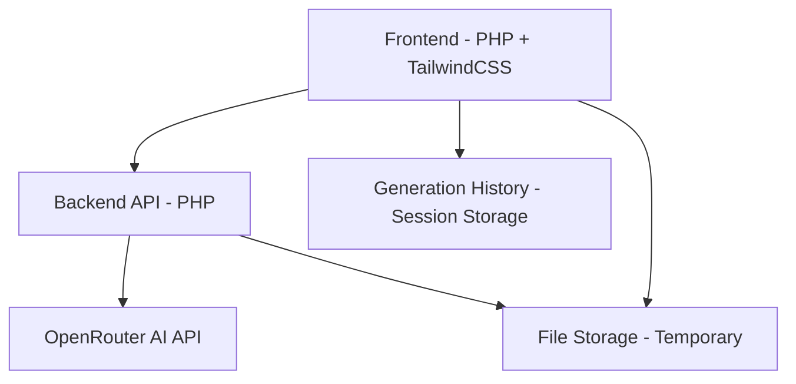
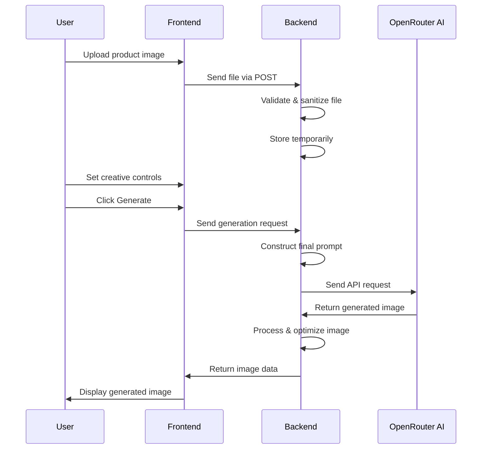

# Neofala Image Generator - Implementation Plan

## System Architecture



## Detailed Implementation Steps

### Phase 1: Project Setup & Foundation

#### 1.1 Project Structure
```
neofala-image-generator/
├── index.php                 # Main application entry point
├── assets/
│   ├── css/
│   │   └── tailwind.css      # TailwindCSS compiled styles
│   └── js/
│       └── app.js           # Main JavaScript functionality
├── includes/
│   ├── config.php           # Configuration settings
│   ├── database.php         # Database connection (if needed)
│   └── functions.php        # Utility functions
├── api/
│   └── generate.php         # AI image generation API endpoint
├── uploads/
│   ├── temp/               # Temporary file storage
│   └── processed/          # Processed images
├── templates/
│   ├── header.php          # HTML header
│   ├── footer.php          # HTML footer
│   └── components/         # Reusable UI components
└── vendor/                 # Composer dependencies
```

#### 1.2 Technology Stack
- **Backend**: PHP 8.0+
- **Frontend**: HTML5, TailwindCSS, JavaScript
- **UI Components**: ShadCN (via CDN or custom implementation)
- **AI Integration**: OpenRouter AI API
- **File Processing**: GD Library or ImageMagick
- **Session Management**: PHP Sessions

### Phase 2: Frontend Implementation

#### 2.1 Main Interface Components
- **Upload Area**: Drag-and-drop zone for product images
- **Style Reference Upload**: Optional second upload area
- **Creative Controls Panel**: 
  - Aspect ratio selector (1:1, 3:4, 16:9, custom)
  - Lighting style dropdown
  - Camera perspective dropdown
  - Additional prompt text area
- **Generate Button**: Trigger image generation
- **Preview Panel**: Display generated image
- **History Panel**: Show previous generations

#### 2.2 UI/UX Requirements
- Responsive design for mobile and desktop
- Loading states during image generation
- Error handling and user feedback
- Progress indicators for API calls

### Phase 3: Backend Implementation

#### 3.1 Core Components
- **File Upload Handler**: 
  - Validate image format (PNG/JPG)
  - Check file size limits
  - Sanitize file names
  - Store in temporary directory

- **Prompt Generator**:
  - Combine product image description
  - Apply style reference aesthetics
  - Incorporate creative controls
  - Add user-provided instructions

- **AI Integration**:
  - OpenRouter API client
  - Request formatting
  - Response handling
  - Error management

- **Session Management**:
  - Store generation history
  - Maintain user preferences
  - Cache temporary files

#### 3.2 Security Measures
- File type validation
- File size limits
- Rate limiting on API calls
- Input sanitization
- CSRF protection

### Phase 4: Integration & Testing

#### 4.1 API Integration Flow


#### 4.2 Testing Strategy
- Unit testing for core functions
- Integration testing for API calls
- User acceptance testing
- Performance testing
- Security testing

### Phase 5: Deployment & Optimization

#### 5.1 Performance Optimizations
- Image compression before upload
- Caching of frequently used prompts
- Asynchronous processing for large files
- CDN integration for static assets

#### 5.2 Monitoring & Analytics
- Generation time tracking
- Error logging
- User behavior analytics
- API usage monitoring

## Technical Specifications

### File Upload Requirements
- **Supported Formats**: PNG, JPG, JPEG
- **Max File Size**: 10MB per image
- **Max Dimensions**: 4096x4096 pixels
- **Validation**: MIME type checking, dimension validation

### API Integration Details
- **Endpoint**: OpenRouter AI image generation
- **Authentication**: API key in headers
- **Request Format**: JSON with structured prompt
- **Response**: Base64 encoded image or URL
- **Timeout**: 30 seconds maximum
- **Rate Limiting**: 5 requests per minute per session

### Session Management
- **Storage**: PHP file-based sessions
- **Duration**: 30 minutes inactive timeout
- **Data**: Generation history, temporary files
- **Cleanup**: Automatic session cleanup

## Success Criteria

### Functional Requirements
- ✅ Product image upload with drag-and-drop
- ✅ Optional style reference upload
- ✅ Creative controls (aspect ratio, lighting, perspective)
- ✅ Prompt generation and AI integration
- ✅ High-resolution image output
- ✅ Download functionality
- ✅ Generation history per session

### Non-Functional Requirements
- ✅ <20 second generation time
- ✅ Mobile-responsive design
- ✅ Secure file handling
- ✅ Error handling and user feedback
- ✅ Cross-browser compatibility

### Performance Metrics
- Page load time < 3 seconds
- Image generation < 20 seconds
- File upload < 5 seconds for 10MB images
- 99.9% uptime for core functionality